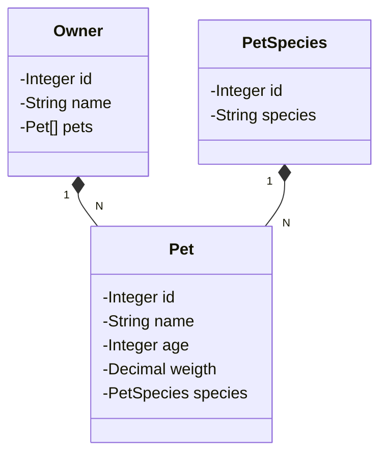

# Santader Dev Week 2023 - REST API deployed on Railway
A simple RESTful API project deployed on Railway service

## Technologies
- Spring Boot 3
- Java 17
- Swagger
- Unit testing with JUnit 5 and Mockito

## How to use
The API was deployed to Railway and you can access the Swagger page information on [https://web-production-212c.up.railway.app/swagger-ui.html](https://web-production-212c.up.railway.app/swagger-ui.html)

## Database

